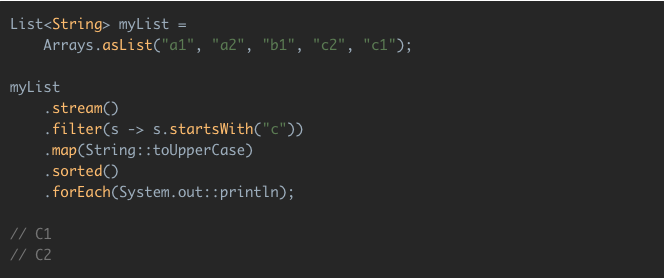

# Práctica 3: Streams

## <span style="color:blue">Repaso de conceptos teóricos</span>

## Stream API en Java

### Definición de Stream procedente de prácticas anteriores

Un *stream* representa una secuencia de elementos que soportan diferentes tipos de operaciones para realizar cálculos sobre ellos.

Las posibles operaciones que se pueden realizar sobre un *stream* pueden ser _intermediarias_ o _terminales_.

- Las operaciones intermediarias devuelven un nuevo *stream*, permitiendo encadenar múltiples operaciones intermediarias sin usar punto y coma.
- Por otro lado, las operaciones terminales son nulas o devuelven un resultado de un tipo diferente, por ejemplo un tipo numérico.

>
>
<small>por <cite>Benjamin, [Java 8 Stream Tutorial](https://winterbe.com/posts/2014/07/31/java8-stream-tutorial-examples/)</cite></small>

En el ejemplo anterior, las operaciones `filter`, `map` y `sorted` son operaciones intermediarias, mientras que la operación `forEach` es una operación terminal.

Más información: https://www.oracle.com/technetwork/es/articles/java/procesamiento-streams-java-se-8-2763402-esa.html

Por otro lado, se puede observar que la mayoría de las operaciones que se aplican sobre *streams* aceptan algún tipo de parámetro en forma de *expresión lambda*, que es una interfaz funcional que especifica el comportamiento exacto de la operación. Estas operaciones no pueden modificar el contenido del *stream* original.

En el ejemplo anterior, se puede observar que ninguna de las operaciones modifica la variable `myList` añadiendo o eliminando elementos, sino que sólo se realiza el filtrado de los elementos que no empiezan por "c", se transforman a mayúsculas, se ordenan en orden alfabético y se imprimen por pantalla.

Más información: https://www.oracle.com/technetwork/es/articles/java/expresiones-lambda-api-stream-java-2737544-esa.html

Finalmente, se incluye otro ejemplo del uso del Stream API en Java:

```java
ArrayList<Integer> mayores = (ArrayList<Integer>) Arrays
    .asList(1, 2, 3, 4, 5, 6, 7, 8, 9, 10)
    .stream()
    .filter(x -> x > 5)
    .collect(
       Collectors.toCollection(() -> new ArrayList<Integer>())
    );

mayores.forEach(e -> System.out.println(e));
```

En el ejemplo anterior se realiza el filtrado de los números que sean mayores que 5 y, posteriormente, se imprimen por pantalla los elementos de la lista. Por lo tanto, la salida del programa por consola en este caso sería:

```
6
7
8
9
10
```

### Definición de operaciones disponibles en la API

A continuación, se describen las operaciones disponibles en el Stream API haciendo la comparativa con las consultas realizadas en SQL:

#### Consultas simples

En este caso se desea listar el nombre de todos los productos disponibles en la base de datos.

Si se considera la siguiente consulta SQL:

```sql
select name from products;
```

El equivalente con Stream API sería:

```java
List<Products> products;

...

Stream<String> streams = products.stream().map(Product::getName);
```

- Con el método `stream()` se obtiene la secuencia de elementos de tipo `Product`. Sería equivalente al `from` de SQL.
- Con el método `map` se recupera únicamente el atributo `name`. Sería equivalente al `select` de SQL.

#### Consultas con filtrado

En este caso se desea listar los nombres de los productos cuya existencia en el almacen sea menor a 10 unidades.

Si se considera la siguiente consulta SQL:

```sql
select name from products where units_in_stock < 10;
```

El equivalente con Stream API sería:

```java
Stream<String> streams = products.stream().filter(p -> p.getUnitsInStock() < 10).map(Product::getName);

streams.forEach(product -> System.out.println(product));
```

- Con el método `stream()` se obtiene la secuencia de elementos de tipo `Product`. Sería equivalente al `from` de SQL.
- Con el método `filter` se recuperan únicamente los productos que cumplan la condición que se le pasa como parámetro. En este caso, los que su número de unidades sea mayor a 10. Sería equivalente al `where` de SQL.
- Con el método `map` se recupera únicamente el atributo `name`. Sería equivalente al `select` de SQL.

#### Consultas con ordenación

En este caso se desea listar los nombres de los productos cuya existencia en el almacén sea menor a 10 unidades pero en orden ascendente, es decir, de menor existencia a mayor existencia.

Si se considera la siguiente consulta SQL:

```sql
select name from products where units_in_stock < 10
order by units_in_stock asc;
```

El equivalente con Stream API sería:

```java
Stream<String> streams = products.stream()
                .filter(p -> p.getUnitsInStock() < 10)
                .sorted(Comparator.comparingDouble(Product::getUnitsInStock))
                .map(Product::getName);
```

- Con el método `stream()` se obtiene la secuencia de elementos de tipo `Product`. Sería equivalente al `from` de SQL.
- Con el método `filter` se recuperan únicamente los productos que cumplan la condición que se le pasa como parámetro. En este caso, los que su número de unidades sea mayor a 10. Sería equivalente al `where` de SQL.
- Con el método `sorted` se recuperan los productos utilizando el método de ordenación que recibe como parámetro. En este caso, los recupera en orden ascendente comparando su número de unidades. Sería equivalente al `order by` de SQL.
- Con el método `map` se recupera únicamente el atributo `name`. Sería equivalente al `select` de SQL.

#### Consultas con agrupación

En este caso se desea listar el número de productos agrupados por proveedor.

Si se considera la siguiente consulta SQL:

```sql
select count(1), supplierID from products
group by supplierID
```

El equivalente con Stream API sería:

```java
Map<Integer, Long> collect = products.stream()
    .collect(
        Collectors.groupingBy(
            Product::getSupplier,
            Collectors.counting()
        )
    );

collect.forEach((s, c) -> System.out.printf("proveedor: %s: productos: %s \n", s,c));
```

- Con el método `stream()` se obtiene la secuencia de elementos de tipo `Product`. Sería equivalente al `from` de SQL.
- Con el método `collect` se realiza el agrupamiento a través de los criterios recibidos como parámetros. En este caso, los productos se agrupan por proveedor y se cuentan. Sería el equivalent a `group by` en SQL.

#### Consultas con sumatorios

En este caso se desea obtener la suma del precio unitario de todos los productos agrupados por el número existente en el almacen.

Si se considera la siguiente consulta SQL:

```sql
select  unitsInStock, sum(unitPrice) from products
group by unitsInStock;
```

El equivalente con Stream API sería:

```java
Map<Integer, Double> collect = products.stream()
        .collect(
            Collectors.groupingBy(
                Product::getUnitsInStock,
                Collectors.summingDouble(
                    Product::getUnitPrice
                )
            )
        );

collect.forEach((stock, suma) -> System.out.printf("en stock: %s: suma: %s \n", stock,suma));
```

- Con el método `stream()` se obtiene la secuencia de elementos de tipo `Product`. Sería equivalente al `from` de SQL.
- Con el método `collect` se realiza el agrupamiento a través de los criterios recibidos como parámetros. En este caso, los productos se agrupan por número de unidades existentes en el almacen y se suman. Sería el equivalent a `group by` con el uso de `sum` en SQL.

#### Consultas con filtrado sobre grupos

En este caso se desea obtener la suma del precio unitario de todos los productos agrupados por su número de existencias en el almacen, pero solo obtener aquellos productos cuya suma sea mayor a 100.

Si se considera la siguiente consulta SQL:

```sql
select  unitsInStock, sum(unitPrice) from products
group by unitsInStock
having sum(unitPrice) > 100;
```

El equivalente con Stream API sería:

```java
List<Map.Entry<Integer, Double>> entryList = products.stream()
    .collect(
        Collectors.groupingBy(
            Product::getUnitsInStock,
            Collectors.summingDouble(
                Product::getUnitPrice
            )
        )
    ).entrySet()
    .stream()
    .filter(p -> p.getValue() > 100)
    .collect(Collectors.toList());

entryList.forEach(list -> System.out.printf("en stock: %s, suma: %s\n",list.getKey(), list.getValue()));
```

- Con el método `stream()` se obtiene la secuencia de elementos de tipo `Product`. Sería equivalente al `from` de SQL
- Con el método `collect` se realiza el agrupamiento a través de los criterios recibidos como parámetros. En este caso, los productos se agrupan por número de unidades existentes en el almacen y se suman. Sería el equivalent a `group by` con el uso de `sum` en SQL.
- Con el método `filter` se recuperan únicamente los productos que cumplan la condición que se le pasa como parámetro. En este caso, los que la suma sea mayor a 100. En este caso, sería equivalente al `having` de SQL porque va detrás de una operación con criterios de agrupación.


## <span style="color:blue">Ejercicios propuestos</span>

### Ejercicio 1

Dados los siguientes fragmentos de código, responder a las siguientes preguntas:

#### Employee.java

```java
public class Employee {

    String name;
    int age;

    public Employee(String name, int age) {
        this.name = name;
        this.age = age;
    }

    public String getName() {
        return name;
    }

    public void setName(String name) {
        this.name = name;
    }

    public int getAge() {
        return age;
    }

    public void setAge(int age) {
        this.age = age;
    }

    public String toString() {
        return "Name = " + name + ", Age = " + age;
    }
}
```

#### EmployeeDatabase.java

```java
import java.util.ArrayList;
import java.util.Arrays;
import java.util.List;

public class EmployeeDatabase {

    private static List<Employee> employees = Arrays.asList(
            new Employee("Employee1", 20),
            new Employee("Employee2", 30),
            new Employee("Employee3", 40),
            new Employee("Employee4", 50));

    public static Employee getEmployeeByName(String name) {
        Employee result = null;
        for(Employee e: employees) {
            if(e.getName().equals(name)) {
                result = e;
            }
        }
        return result;
    }

    public static Employee getEmployeeByNameAndAge(String name, int age) {
        Employee result = null;
        for(Employee e: employees) {
            if(e.getName().equals(name) && e.getAge() == age) {
                result = e;
            }
        }
        return result;
    }

    public static List<Employee> getEmployeeByAgeOver(int limitAge) {
        List<Employee> result = new ArrayList<Employee>();
        for(Employee e: employees) {
            if(e.getAge() > limitAge) {
                result.add(e);
            }
        }
        return result;
    }

    public static List<Employee> getEmployeeByAgeUnder(int limitAge) {
        List<Employee> result = new ArrayList<Employee>();
        for(Employee e: employees) {
            if(e.getAge() < limitAge) {
                result.add(e);
            }
        }
        return result;
    }
}
```

#### Main.java

```java
public class Main {
    public static void main(String args[]) {
        System.out.println("Employee = " + EmployeeDatabase.getEmployeeByName("Employee1"));
        System.out.println("Employee = " + EmployeeDatabase.getEmployeeByName("EmployeeNull"));
        System.out.println("Employee = " + EmployeeDatabase.getEmployeeByNameAndAge("Employee2", 30));
        System.out.println("Employee = " + EmployeeDatabase.getEmployeeByNameAndAge("Employee2", 20));
        System.out.println("Employees = " + EmployeeDatabase.getEmployeeByAgeOver(30));
        System.out.println("Employees = " + EmployeeDatabase.getEmployeeByAgeUnder(30));
    }
}
```

1. Modifique las operaciones de la clase `EmployeeDatabase` utilizando las operaciones de la API para Stream de Java 8.
2. Extienda la API de la clase `EmployeeDatabase` añadiendo las siguientes operaciones:

    - Obtener los empleados cuya edad este comprendida entre un rango dado en la operación como parámetros (`maxAge` y `minAge`).
    - Obtener los empleados ordenados ascendentemente por su edad.
    - Obtener los empleados ordenados descendentemente por su edad.
    - Obtener el número de empleados que existen en la base de datos.
    - Obtener el número de empleados que existen en la base de datos y su nombre es igual a uno dado en la operación como parámetro.

### Ejercicio 2

Basándose en el código del ejercicio anterior, implemente una API para una tienda de videojuegos, teniendo en cuenta lo siguiente:

1. Implemente la clase `Videogame` contemplando los siguientes criterios:

    a) La clase contendrá los siguientes atributos:

    - El título de tipo string.
    - La categoría de tipo string.
    - El precio de tipo double.

    b) La clase contendrá las operaciones `set` y `get` necesarias para el acceso a los atributos anteriores.

2. Implemente la clase `VideogameDatabase` contemplando los siguientes criterios:

    a) La clase contendrá los siguientes atributos:

    - La lista de videojuegos existentes de tipo `Videogame`.

    b) La clase contendrá las siguientes operaciones implementadas con el Stream API de Java 8:

    - Listar todos los títulos de los videojuegos.
    - Listar todos los títulos de los videojuegos cuyo precio sea superior a 20€.
    - Listar todos los títulos de los videojuegos cuya categoría sea terror.
    - Listar todos los títulos de los videojuegos cuyo precio sea superior a 20€ ordenados ascendentemente por el precio.
    - Listar todos los títulos de los videojuegos cuyo precio sea superior a 20€ ordenados descendentemente por el precio.
    - Obtener el número de videojuegos agrupados por categoría.
    - Obtener la suma de los precios de los videojuegos agrupados por categoría.
    - Obtener la suma de los precios de los videojuegos agrupados por cateogoría, siempre que el precio obtenido de la suma sea superior a 200€.

3. Implemente además un programa de prueba `Main` que ilustre el uso de las operaciones anteriores.

## Referencias

[Java 8 Stream Tutorial]: https://winterbe.com/posts/2014/07/31/java8-stream-tutorial-examples/
[[1] Blog: Java 8 Stream Tutorial.][Java 8 Stream Tutorial]
[API Java Streams]: https://www.oracle.com/technetwork/es/articles/java/procesamiento-streams-java-se-8-2763402-esa.html
[[2] Documentación Oficial Java: Procesamiento de datos con streams de Java SE 8.][API Java Streams]
[API Java Funciones Lambda + Streams]: https://www.oracle.com/technetwork/es/articles/java/expresiones-lambda-api-stream-java-2737544-esa.html
[[3] Documentación Oficial Java: Introducción Expresiones Lambda y API Stream en Java SE 8.][API Java Funciones Lambda + Streams]
[Java 8 Stream workshop]: https://windoctor7.github.io/API-Stream-Java8.html
[[4] Blog: API Stream de Java 8 (workshop).][Java 8 Stream workshop]
