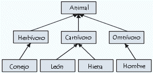
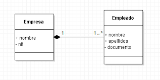
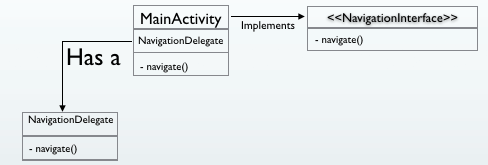
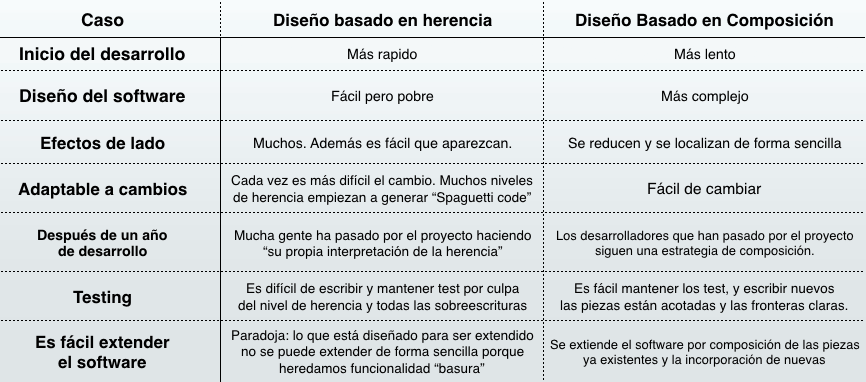

# Práctica 1: Herencia, composición y polimorfismo

## <span style="color:blue">Repaso de conceptos teóricos</span>

## Herencia

### Definición

Se puede definir la herencia como el mecanismo por el cual una clase permite heredar sus características (atributos y métodos) a otra clase. Este mecanismo puede ser usado para la reutilización de código, la cual permite realizar extensiones independientes del software original.



En el ejemplo de la imagen anterior existe una jerarquía de herencia de tres niveles en los que:

- Todas las clases heredan las funciones y propiedades de la clase "Animal".

- La clase "Conejo" hereda las funciones y propiedades de la clase "Herbívoro", las clases "León" y "Hiena" las de la clase "Carnívoro" y la clase "Hombre" las de la clase "Omnívoro".

### ¿Cuándo utilizar la herencia?

La herencia debe ser utilizada cuando se cumplen al menos las siguientes condiciones:

- **Existe una relación "es un/una" entre las entidades**. Por ejemplo: un león o una hiena son animales, pero un animal no tiene porque ser un león (puede ser cualquiera de las otras subclases). Esto es debido a que la relación de herencia es unidireccional.

- **Se conoce el 100% de los requisitos del software y éstos no van a cambiar**. Si se conoce perfectamente los requisitos del software que se va a implementar y  estos no van a cambiar, se puede deducir las relaciones de herencia que existirán entre las clases desde el principio. No obstante, en cualquier otro caso puede ser costoso durante el desarrollo eliminar/mantener estas relaciones si los requisitos van evolucionando en otro sentido. Por ejemplo, esto sucedería dentro de un proyecto donde se aplica una metodología de desarrollo ágil.

### Polimorfismo en la herencia

La herencia otorga la propiedad de polimorfismo, que significa que cualquiera de las subclases pueden adoptar la forma de la superclase. Esta es una de las principales ventajas de la herencia, ya que el polimorfismo permite la abstracción del objeto concreto y usar su superclase. 

Por ejemplo, podríamos tratar cualquier instancia de la clase "Hombre" o "León" como una instancia de la clase "Animal", ya que han herendado todas sus funciones y propiedades. Pero no al contrario, ya que la clase "León" podría haber añadido nuevas propiedades o funciones que no estén disponibles en la clase "Animal".

### ¿Cuáles son las ventajas de la herencia?

Las ventajas que nos propone el uso de la herencia son las siguientes:

- Permite reutilizar código de una manera rápida y sencilla.

- Permite el uso del polimorfismo con facilidad.

- Permite sobreescribir métodos, adaptándolos a necesidades específicas.

- Permite crear clases abstractas que hacen de plantilla a las subclases (parecido al patrón de diseño "Template Method").

## Composición

### Definición

La composición se basa en la creación de clases que realizarán una única y específica función que complementaran a otras clases, las cuales estarán compuestas por ellas. Este mecanismo, nos permitirá delegar las funciones a aquellas clases que se han implementado únicamente para cubrirlas, reutilizando su código fuente donde sea necesario.



En el ejemplo anterior se puede observar:

- La clase "Empresa" esta compuesta por instancias de la clase "Empleado".

- La clase "Empleado" es el compuesto de la clase "Empresa", de hecho se establece una relación donde la cardinalidad es 1..N por lo que la clase "Empresa" en su implementación mantendrá una lista de instancias de la clase "Empleado".

### ¿Cuándo utilizar la composición?

La composición debe ser utilizada cuando se cumplen al menos las siguientes condiciones:

- **No existe una relación "es un/una" entre las entidades, si no "tiene"**. Por ejemplo: a una persona que le encanta correr se le podría clasificar como "runner", pero establecerlo como herencia sería un error, ya que la persona con el paso del tiempo podría dejar de serlo. En este caso, sería más correcto decir que tiene el "rol" de runner usando la composición, pudiéndolo eliminar cuando fuese necesario.

- **No se conocen 100% los requisitos del software y éstos serán actualizados**. Cuando no se conocen por completo los requisitos del sistema es más correcto no establecer relaciones de herencia que pudiesen ser eliminadas posteriormente. Por este motivo, crear clases con las funciones específicas y vincularlas a otras haciendo uso de la composición, proporciona mayor flexibilidad y tolerancia a cambios en la implementación. Además, permite modularizar el sistemma de forma de que sea posteriormente más facil de mantener.

### Polimorfismo en la composición

La composición por si misma no es polimórfica, lo cual puede ser de sus mayores desventajas. No obstante, esto puede ser facilmente solventado con el uso de interfaces. De esta manera, los objetos compuestos implementarán las interfaces que interese en cada situación, consiguiendo añadir/eliminar las funciones que implementan sin necesidad de afectar a la funcionalidad propuesta por otras clases.



En el ejemplo anterior se puede observar:

- La clase "MainActivity" tiene una funcionalidad dada por un elemento que contiene de la clase "NavigationDelegate". Por otro lado, la forma de notificar al resto de clases de que proporciona la funcionalidad "navigate()" es implementando la interfaz "NavigationInterface".

- Cuando la clase "MainActivity" no deba proporcionar la funcionalidad "navigate()" únicamente debe dejar de implementar la interfaz "NavigationInterface" y eliminar la instancia de la clase "NavigationDelegate" o dejar de invocar a su función "navigate()".

## Herencia vs composición

Como se ha comentado anteriormente, la herencia es un mecanismo muy potente para reutilizar código fuente, pero no siempre es la mejor técnica para conseguir este objetivo. Ya que, si se usa la herencia de forma inapropiada se puede conseguir software poco seguro y robusto. Además, el uso de herencia viola el principio de encapsulación, ya que la subclase siempre dependerá de la implementación de los métodos en la superclase (a no ser que los sobreescriba), y éstos métodos se actualizarán en futuras versiones, con lo que se conseguirá incertidumbre en la funcionalidad del código fuente programado.

A continuación, se muestra una tabla que incluye las diferencias de uso entre la herencia y la composición en algunas de las etapas del desarrollo software y en otros aspectos de interés:



## <span style="color:blue">Ejercicios propuestos</span>

### Ejercicio 1

Dado los siguientes fragmentos de código responder a las siguientes preguntas:

#### ElementsSet.java

```java
public class ElementsSet<E> extends HashSet<E> {
	//Number of attempted elements insertions using the "add" method
	private int numberOfAddedElements = 0;

	public ElementsSet() {}

	@Override
	public boolean add(E element) {
		numberOfAddedElements++; //Counting the element added
		return super.add(element);
	} 

	@Override
	public boolean addAll(Collection<? extends E> elements) {
		numberOfAddedElements += elements.size(); //Counting the elements added
		return super.addAll(elements);
	} 

	public int getNumberOfAddedElements() {
		return numberOfAddedElements;
	}
}
```

#### Main.java

```java
...
	ElementsSet<String> set = new ElementsSet<String>();
	set.addAll(Arrays.asList("One", "Two", "Three"));
	System.out.println(set.getNumberOfAddedElements());
...
```

#### Preguntas propuestas:

a) ¿Es el uso de herencia adecuado para la implementación de la clase "ElementsSet"?, ¿qué salida muestra la función "System.out.println" al invocar el método "getNumberOfAddedElements", 3 o 6?.

b) En el caso de que haya algún problema en la implementación anterior, proponga una solución alternativa usando composición que resuelva el problema.

### Ejercicio 2

#### Animal.java

```java
public abstract class Animal {
	//Number of legs the animal holds
	protected int numberOfLegs = 0;

	public abstract String speak();

	public abstract boolean eat(String typeOfFeed);

	public abstract int getNumberOfLegs();
}
```

#### Cat.java

```java
public class Cat extends Animal {
	@Override
	public String speak() {
		return "Meow";
	}

	@Override
	public boolean eat(String typeOfFeed) {
		if(typeOfFeed.equals("fish")) {
			return true;
		} else {
			return false;
		}
	}

	@Override
	public int getNumberOfLegs() {
		return super.numberOfLegs;
	}
}
```

#### Dog.java

```java
public class Dog extends Animal {
	@Override
	public String speak() {
		return "Woof";
	}

	@Override
	public boolean eat(String typeOfFeed) {
		if(typeOfFeed.equals("meat")) {
			return true;
		} else {
			return false;
		}
	}

	@Override
	public int getNumberOfLegs() {
		return super.numberOfLegs;
	}
}
```

#### Main.java

```java
...
	Animal cat = new Cat();
	Animal dog = new Dog();
	System.out.println(cat.speak());
	System.out.println(dog.speak());
...
```

#### Preguntas propuestas:

a) ¿Es correcto el uso de herencia en la implementación de las clases "Cat" y "Dog"?. ¿Qué beneficios se obtiene?.

b) En el caso de que no sea correcto, proponga una solución alternativa. ¿Cuáles son los beneficios de la solución propuesta frente a la original?.

## Referencias

[Blog sobre herencia vs composición]: https://devexperto.com/herencia-vs-composicion/
[[1] Blog sobre herencia vs composición.][Blog sobre herencia vs composición]
[Libro effective Java: A programming Language Guide]: https://www.amazon.es/Effective-Java-2nd-Edition-Programming/dp/0321356683/tag=licrla-21
[[2] Libro effective Java: A programming Language Guide.][Libro effective Java: A programming Language Guide]