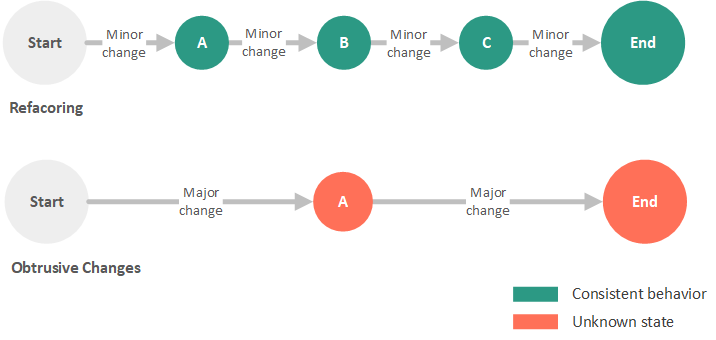

# Práctica 2: Refactoring

## <span style="color:blue">Repaso de conceptos teóricos</span>

## Refactoring

### Definición

El proceso de refactoring es un proceso sistemático, en el cual se pretende cambiar la estructura del software implementado para hacerlo más fácil de entender y más rápido de modificar sin cambiar su comportamiento. Es decir, en este proceso se pretende mejorar la calidad del código fuente sin crear nueva funcionalidad.

> Refactoring is a controlled technique for improving the design of an existing code base. Its essence is applying a series of small behavior-preserving transformations, each of which "too small to be worth doing". However the cumulative effect of each of these transformations is quite significant. By doing them in small steps you reduce the risk of introducing errors. You also avoid having the system broken while you are carrying out the restructuring — which allows you to gradually refactor a system over an extended period of time.
> 
> -- <cite>[Martin Fowler](https://www.amazon.es/Refactoring-Improving-Design-Existing-Technology/dp/0201485672/ref=sr_1_fkmr0_1?__mk_es_ES=ÅMÅŽÕÑ&dchild=1&keywords=refactoring+improving+the+design+of+existing+code+first+edition&qid=1584952603&sr=8-1-fkmr0)</cite>

Por lo tanto, en el proceso de refactorización se deben realizar pequeñas modificaciones, las cuales sean manejables y vayan incrementando gradualmente la limpieza de código mientras se mantiene la funcionalidad del mismo. Conforme se realizan estos cambios, se comienza a transformar el código inicial en un código más simple, más fácil de leer y más mantenible. No es una simple refactorización lo que realiza el cambio, si no el efecto acumulativo de muchos pequeños "refactorings" realizados hacía un sólo objetivo.

>
>
<small>por <cite>Justin Albano, [What Is Refactoring?](https://dzone.com/articles/what-is-refactoring)</cite></small>

### Razones para refactorizar

A continuación, según [[1]][Libro Code Complete: A Practical Handbook of Software Construction, Second Edition] se listan las posibles razones que promueven la refactorización del código:

- Código duplicado.
- Una función es demasiado larga.
- Un bucle es demasiado largo o está demasiado anidado (demasiada complejidad).
- Una clase tiene poca cohesión.
- Una interfaz no proporciona un nivel consistente de abstracción.
- Una lista de parámetros tiene demasiados parámetros.
- Los cambios dentro de una clase tienden a afectar a otras clases.
- Las jerarquías de herencia tienen que ser modificadas en paralelo (afecta a todas las subclases un mismo cambio).
- Los atributos que se utilizan por varias clases no están organizados en una clase (se repiten).
- Una función utiliza más características propuestas por otra clase que de su propia clase.
- Un tipo de datos primitivo esta sobrecargado.
- Una clase no tiene una finalidad clara (no aporta mucho).
- Un objeto intermediario no hace nada.
- Una función tiene un nombre que no especifica de forma clara su objetivo.
- Los atributos de una clase son públicos.
- Una subclase sólo utiliza un porcentaje mínimo de las funciones que hereda.
- Se utilizan comentarios para explicar código díficil de entender.
- Se usan variables globales.
- Una función contiene código que parece que será necesario algún día pero en la actualidad no se utiliza.

### Resumen de posibles refactorizaciones

Finalmente, a continuación se incluye algunas de las posibles refactorizaciones propuestas en [[1]][Libro Code Complete: A Practical Handbook of Software Construction, Second Edition]. La aplicación de estas técnicas de refactorización dependerá de si en el softare implementado se encuentran alguno/s de los problemas incluidos en la lista anterior:

#### Refactorización en el uso de datos

- Reemplazar un número utilizado directamente por una constante.
- Renombrar una variable para darle un nombre más claro o explicativo.
- Convertir una variable que se usa en múltiples sitios en múltiples variables de único uso.
- Usar una variable local para propósitos locales en lugar de un parámetro de una función.
- Convertir el uso de datos primitivos en el uso de una clase.
- Convertir un array (de bajo nivel) en un objeto.
- Encapsular una colección.

#### Refactorización en la implementación de sentencias/instrucciones

- Descomponer una expresión lógica.
- Convertir una expresión lógica compleja en una función lógica con un nombre correcto para su definición.
- Unificar fragmentos de código duplicado en diferentes partes de una expresión condicional.
- Eliminar el uso de "break" o "return" en lugar del uso de variables de control en los bucles.
- Devolver lo más rápido posible la solución en lugar de asignar el valor a una variable dentro de instrucciones if-else.
- Reemplazar condicionales (especialmente las sentencias "case") por el uso de polimorfismo.

#### Refactorización en la implementación de funciones

- Extraer una función desde código que se repite en varios lugares.
- Convertir una función demasiado larga en una clase.
- Sustituir un algoritmo complejo por uno simple.
- Combinar funciones similares en una única.
- Pasar el objeto completo en lugar de seleccionar algunos campos específicos (en el caso de que sean muchos).
- Pasar algunos campos específicos en lugar del objeto completo (en el caso de que sean pocos campos los utilizados).

#### Refactorización en la implementación de clases/interfaces

- Extraer código especializado en subclases.
- Combinar código similar en superclases.
- Mover una función a otra clase en la que tenga más coherencia.
- Convertir una clase demasiado larga en dos.
- Eliminar una clase sin utilidad.
- Reemplazar herencia por composición (en el caso de que sea necesario).
- Reemplazar composición por herencia (en el caso de que sea necesario).
- Unificar una superclase y una subclase si su implementación es muy similar.

#### Refactorización a nivel de sistema

- Cambiar la asociación unidireccional de clases a bidireccional (en caso de que sea necesario).
- Cambiar la asociación bidireccional de clases a unidireccional (en caso de que sea necesario).
- Proveer de una factoria para crear los objetos en lugar de usar un constructor simple.
- Reemplazar los códigos de error con excepciones (en caso de que sea necesario).

## <span style="color:blue">Ejercicios propuestos</span>

### Ejercicio 1

Dado los siguientes fragmentos de código responder a las siguientes preguntas:

#### GroupOfUsers.java

```java
public class GroupOfUsers {
	
	private static Map<String, Integer> usersWithPoints = new HashMap<String, Integer>() {{
	    put("User1", 800);
	    put("User2", 550);
	    put("User3", 20);
	    put("User4", 300);
	}};
	
	public List<String> getUsers() {
		List<String> users = new ArrayList<String>();
		
		//Sorting users by points
		usersWithPoints.entrySet()
		.stream()
		.sorted(Map.Entry.<String, Integer>comparingByValue().reversed())
		.forEachOrdered(x -> users.add(x.getKey()));
		
		//Capitalizing the names of the users
		List<String> usersCapitalized = new ArrayList<String>();
		users.forEach(x -> usersCapitalized.add(x.toUpperCase()));
		
		return usersCapitalized;
	}

}
```

#### Main.java
```java
...
	GroupOfUsers group = new GroupOfUsers();
	List<String> users = group.getUsers();
	System.out.println("The users are: " + users);
...
```

#### Preguntas propuestas

a) ¿Existe algún tipo de problema en la implementación anterior?, ¿es necesario aplicar refactoring en este caso?. En el caso de que existan problemas, detalle cuáles son y qué tipos de problemas generarían en el futuro si no se aplica el refactoring ahora.

b) En el caso de la implementación necesite la aplicación de refactoring, realice los cambios oportunos e indique las mejoras que aporta su implementación respecto a la original.

### Ejercicio 2

Dado los siguientes fragmentos de código responder a las siguientes preguntas:

#### GroupOfUsers.java

```java
public class GroupOfUsers {
	
	private static Map<String, Integer> usersWithPoints_Group1 = new HashMap<String, Integer>() {{
	    put("User1", 800);
	    put("User2", 550);
	    put("User3", 20);
	    put("User4", 300);
	}};
	
	private static Map<String, Integer> usersWithPoints_Group2 = new HashMap<String, Integer>() {{
	    put("User1", 10);
	    put("User2", 990);
	    put("User3", 760);
	    put("User4", 230);
	}};
	
	private static Map<String, Integer> usersWithPoints_Group3 = new HashMap<String, Integer>() {{
	    put("User1", 1000);
	    put("User2", 200);
	    put("User3", 5);
	    put("User4", 780);
	}};
	
	public List<ArrayList<String>> getUsers() {
		List<String> users1 = new ArrayList<String>();
		List<String> users2 = new ArrayList<String>();
		List<String> users3 = new ArrayList<String>();
		List<ArrayList<String>> users = new ArrayList<ArrayList<String>>();
		
		//Sorting users by points
		usersWithPoints_Group1.entrySet()
		.stream()
		.sorted(Map.Entry.<String, Integer>comparingByValue().reversed())
		.forEachOrdered(x -> users1.add(x.getKey()));
		
		usersWithPoints_Group2.entrySet()
		.stream()
		.sorted(Map.Entry.<String, Integer>comparingByValue().reversed())
		.forEachOrdered(x -> users2.add(x.getKey()));
		
		usersWithPoints_Group3.entrySet()
		.stream()
		.sorted(Map.Entry.<String, Integer>comparingByValue().reversed())
		.forEachOrdered(x -> users3.add(x.getKey()));
		
		//Capitalizing the names of the users
		List<String> usersCapitalized1 = new ArrayList<String>();
		List<String> usersCapitalized2 = new ArrayList<String>();
		List<String> usersCapitalized3 = new ArrayList<String>();
		
		users1.forEach(x -> usersCapitalized1.add(x.toUpperCase()));
		users2.forEach(x -> usersCapitalized2.add(x.toUpperCase()));
		users3.forEach(x -> usersCapitalized3.add(x.toUpperCase()));
		
		//Adding users to the main list
		users.add((ArrayList<String>)usersCapitalized1);
		users.add((ArrayList<String>)usersCapitalized2);
		users.add((ArrayList<String>)usersCapitalized3);
		
		return users;
	}

}
```

#### Main.java
```java
...
	GroupOfUsers group = new GroupOfUsers();
	List<ArrayList<String>> users = group.getUsers();
	System.out.println("The users are: " + users);
...
```

#### Preguntas propuestas

a) El software del ejercicio anterior ha evolucionado añadiendo nueva funcionalidad en su implementación. ¿Existe algún tipo de problema en esta versión de la implementación?, ¿es necesario aplicar refactoring en este caso?. En el caso de que existan problemas, detalle cuáles son y qué tipos de problemas generarían en el futuro si no se aplica el refactoring ahora.

b) En el caso de la implementación necesite la aplicación de refactoring, realice los cambios oportunos e indique las mejoras que aporta su implementación respecto a la original.

## Referencias
[Libro Code Complete: A Practical Handbook of Software Construction, Second Edition]: https://www.amazon.es/Code-Complete-Practical-Handbook-Construction/dp/B00CNKPY6K/ref=sr_1_1?__mk_es_ES=ÅMÅŽÕÑ&dchild=1&keywords=code+complete+second+edition&qid=1584958289&sr=8-1
[[1] Libro Code Complete: A Practical Handbook of Software Construction, Second Edition.][Libro Code Complete: A Practical Handbook of Software Construction, Second Edition]
[Blog What Is Refactoring]: https://dzone.com/articles/what-is-refactoring
[[2] Blog What Is Refactoring.][Blog What Is Refactoring]


