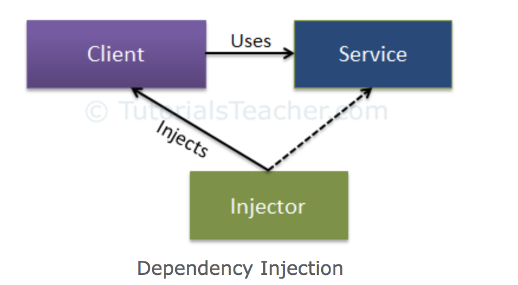

# Práctica 3: Inyección de dependencias & Programación orientada a aspectos

## <span style="color:blue">Repaso de conceptos teóricos</span>

Las dos técnicas siguientes, la inyección de dependencias y la programación de aspectos, nos permiten implementar el principio de ortogonalidad entre componentes software.

## Inyección de dependencias

La inyección de dependencias es una técnica utilizada para implementar la inversión de control (IC, se invierte el flujo tradicional del programa). Por este motivo, permite la creación de objetos fuera de una clase y proporciona esos objetos a otra clase dependiente de ellos de diferentes formas. Utilizando la IC, se traslada la creación y unión de los objetos fuera de la clase que depende de ellos.

>
>
<small>por <cite>TutorialsTeacher, [Dependency Injection](https://www.tutorialsteacher.com/ioc/dependency-injection)</cite></small>

A continuación, se describen los tipos de inyección de dependencias existentes:

- Inyección a través del __constructor__: En este tipo de inyección la clase inyectora suministra la dependencia (servicio) a través del constructor de la clase dependente (cliente).

- Inyección a través de __propiedades__: En este tipo de inyección la clase inyectora suministra la dependenca (servicio) a través de un método "set" de la clase dependiente (cliente).

- Inyección a través de __métodos__: En este tipo de inyección la clase inyectora suministra la dependencia (servicio) a través de un API establecido por la clase dependiente en el que se especifican el/los método/s para suministrar la dependencia (cliente).

A continuación, se listan algunos de los frameworks utilizados para facilitar la implementación de inyección de dependencias en Java:

- Google guice: https://github.com/google/guice/wiki/GettingStarted.
- Spring Framework: https://www.vogella.com/tutorials/SpringDependencyInjection/article.html.
- Eclipse RCP: https://wiki.eclipse.org/Eclipse4/RCP/Dependency_Injection.

## Programación orientada a aspectos

Los aspectos nos permiten agrupar código que se ejecutará en varios lugares en un módulo independiente. Además, este código será inyectado en tiempo de ejecución o compilación (dependiendo del framework) en los puntos de corte especificados en el código fuente. En este caso, la programación orientada a aspectos (AOP) permite introducir nueva funcionalidad dentro de una clase, sin que ésta deba tener conocimiento de su existencia.

> Aspect-oriented programming (AOP) complements object-oriented programming by allowing the developer to dynamically modify the static object-oriented model to create a system that can grow to meet new requirements, allowing an application to adopt new characteristics as it develops.
> 
> -- <cite>[Vangie Beal](https://www.webopedia.com/TERM/A/aspect_oriented_programming.html)</cite>

AspectJ, framework para facilitar la implementación de inyección de dependencias en Java:

- Documentación oficial de AspectJ: https://www.eclipse.org/aspectj/docs.php
- AspectJ Hello World: https://www.baeldung.com/aspectj
- Cheat sheet para la definición de etiquetas en AspectJ: https://blog.espenberntsen.net/2010/03/20/aspectj-cheat-sheet/
- Ejemplo de configuración de la etiqueta *Before* en AspectJ: https://howtodoinjava.com/spring-aop/aspectj-before-annotation-example/
- Ejemplo de configuración de la etiqueta *After* en AspectJ: https://howtodoinjava.com/spring-aop/aspectj-after-annotation-example/

## <span style="color:blue">Ejercicios propuestos</span>

### Ejercicio 1

Dado los siguientes fragmentos de código responder a las siguientes preguntas:

#### DBAccess.java

```java
public interface DBAccess {
    
    public void initConnection();

}
```

#### DBAccessA.java

```java
public class DBAccessA implements DBAccess {
    
    public DBAccessA() {}
    
    public void initConnection() {
        System.out.println("Init A connection with database..");
    }

}
```

#### DBAccessB.java

```java
public class DBAccessB implements DBAccess {
    
    public DBAccessB() {}
    
    public void initConnection() {
        System.out.println("Init B connection with database..");
    }

}
```

#### DBClient.java

```java
public class DBClient {
    
    private DBAccess dbAccess;
    
    public DBClient(DBAccess dbAccess) {
        this.dbAccess = dbAccess;
    }
    
    public void setDBAccess(DBAccess dbAccess) {
        this.dbAccess = dbAccess;
    }
    
    public void getAllFromDataBase() {
        dbAccess.initConnection();
        System.out.println("Returning all data from database..");
    }
    
    public void getSomeDataFromDataBase() {
        dbAccess.initConnection();
        System.out.println("Returning some data from database..");
    }

}
```

#### Main.java

```java
public class Main {
    
    public static void main(String args[]) {
        DBAccess dbAccessB = new DBAccessB();
        DBClient client = new DBClient(dbAccessB);
        System.out.println("Querying all data from database..");
        client.getAllFromDataBase();
        
        DBAccess dbAccessA = new DBAccessA();
        client.setDBAccess(dbAccessA);
        System.out.println("Querying some data from database..");
        client.getSomeDataFromDataBase();
    }

}
```

#### Preguntas propuestas

a) ¿Se realiza inyección de dependencias entre las clases anteriores?, si es así identifique la clase inyectora, el servicio y el cliente.

b) En el caso de que exista inyección de dependencias además indique:

- El método de inyección que se realiza (constructor, propiedad o método).
- La/s línea/s donde se realiza la inyección de dependencias.


### Ejercicio 2

Dado los siguientes fragmentos de código responder a las siguientes preguntas:

#### Bank.java

```java
public class Bank {
    
    public Bank() {}
    
    public void createUser() {
        System.out.println("Creating user..");
    }
    
    public void makeTransaction() {
        System.out.println("Making transaction..");
    }
    
    public void takeMoneyOut() {
        System.out.println("Taking money out..");
    }
    
    public void showUsers() {
        System.out.println("Showing users..");
    }

}
```

#### Main.java

```java
public class Main {
    
    private static Scanner input = new Scanner(System.in);

    public static void main(String args[]) {
        
        System.out.println("AspectJ Bank");
        System.out.println("------------");
        System.out.println("1 - Create user");
        System.out.println("2 - Make transaction");
        System.out.println("3 - Take money out");
        System.out.println("4 - Show users");
        System.out.println("5  - Exit");
        
        int option = Integer.valueOf(input.nextLine());
        Bank bank = new Bank();
        
        switch(option) {
        case 1:
            bank.createUser();
            break;
        case 2:
            bank.makeTransaction();
            break;
        case 3:
            bank.takeMoneyOut();
            break;
        case 4:
            bank.showUsers();
            break;
        case 5:
            System.out.println("Exiting..");
            break;
        }
    }
    
}
```

#### LoginAspect.java

```java
import org.aspectj.lang.JoinPoint;
import org.aspectj.lang.annotation.After;
import org.aspectj.lang.annotation.Aspect;
import org.aspectj.lang.annotation.Before;

@Aspect
public class LoginAspect {
    @Before("..TO-DO..")
    public void before(JoinPoint joinPoint){
        //...TO-DO..
    }
    
    @After("..TO-DO..")
    public void after(JoinPoint joinPoint){
        //...TO-DO..
    }
}
```

#### Preguntas propuestas

En primer lugar, se tiene que configurar el entorno para realizar el ejercicio:

- __Instalar Eclipse IDE for Java Developers__: https://www.eclipse.org/downloads/packages/release/2020-03/r/eclipse-ide-java-developers.
- __Instalar el plug-in de Eclipse para trabajar con AspectJ__: Dentro de Eclipse seleccionar Help > Eclipse Marketplace > Buscar AspectJ Development Tools y hacer click en "Install".
- __Descargar la plantilla del proyecto__: https://drive.google.com/file/d/1_L9cj0BTcqHZEnJK7aPZXplZiDaH9Ow3/view?usp=sharing.
- __Importar el proyecto en Eclipse__: Descomprimir el zip descargado en el paso anterior (P3Ejercicio2_template.zip). Posteriormente, en Eclipse seleccionar File > Import > Projects from Folder or Archive > Click en "Directory" y seleccionar la ruta de la carpeta descomprimida > Click en "Finish".

Posteriormente, complete en la clase "LoginAspect.java" las secciones "TO-DO" de forma que se cumplan las siguientes condiciones:

a) Mostrar el mensaje "The login is required" antes de la ejecución de las operaciones "makeTransaction" y "takeMoneyOut".

b) Mostrar el mensaje "The database is empty" después de la ejecución de la operación "showUsers".

Finalmente, sustituya el fichero "LoginAspect.java" por el fichero "LoginAspect.aj" incluyendo la misma funcionalidad utilizando la sintaxis de AspectJ.

## Referencias

[Dependency Injection Tutorial]: https://www.tutorialsteacher.com/ioc/dependency-injection
[[1] Blog Dependecy Injection.][Dependency Injection Tutorial]

[Google Guice Framework]: https://github.com/google/guice/wiki/GettingStarted
[[2] Google Guice Framework.][Google Guice Framework]

[Spring Framework]: https://www.vogella.com/tutorials/SpringDependencyInjection/article.html
[[3] Spring Framework.][Spring Framework]

[Eclipse RCP]: https://wiki.eclipse.org/Eclipse4/RCP/Dependency_Injection
[[4] Eclipse RCP.][Eclipse RCP]

[AOP Blog]: https://www.webopedia.com/TERM/A/aspect_oriented_programming.html
[[5] Blog Aspect-Oriented Programming.][AOP Blog]

[AspectJ Documentación oficial]: https://www.eclipse.org/aspectj/docs.php
[[6] AspectJ Documentación Oficial.][AspectJ Documentación oficial]

[Intro to AspectJ]: https://www.baeldung.com/aspectj
[[7] Blog Intro to AspectJ.][Intro to AspectJ]

[Java and Spring Development]: https://blog.espenberntsen.net/2010/03/20/aspectj-cheat-sheet/
[[8] Blog Java and Spring Development.][Java and Spring Development]

[AspectJ Before annotation]: https://howtodoinjava.com/spring-aop/aspectj-before-annotation-example/
[[9] Blog AspectJ Before Annotation.][AspectJ Before annotation]


[AspectJ After annotation]: https://howtodoinjava.com/spring-aop/aspectj-after-annotation-example/
[[10] Blog AspectJ After Annotation.][AspectJ After annotation]

